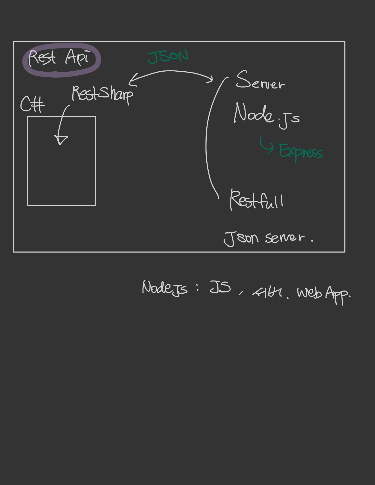

# csharp

2020.12 - 2021.02
- c# study

## 201230
- 간단한 계산기 만들어보기
    + 숫자만 입력 가능
    + comboBox, textBox, Button 사용

## 201231
- multiThread 개념 이해하기
    + Start Button 클릭 시 두개의 threads 동시 실행

- SCS(Simple Server, Client)
    + Client에서 connect Button, message Send Button 누르면 server에게 메세지 전송.
    + server로부터 message 받아오기

## 210101
- Rest API 개념 및 적용
- json, RestSharp을 이용한 간단한 구현
- GET으로 받아온 data를 json으로 바꾸고 원하는 내용을 출력하기

## 210102
- Server 만들어보기
- 전체적인 큰 그림 정리

---

앞으로 2달동안

하루 4시간 ==> programming study
월 20일
카록으로 출퇴근 기록

Node.js , Express , C# => C#을 더 해보기
생활코딩 
https://opentutorials.org/course/2136/11884
들어보기

